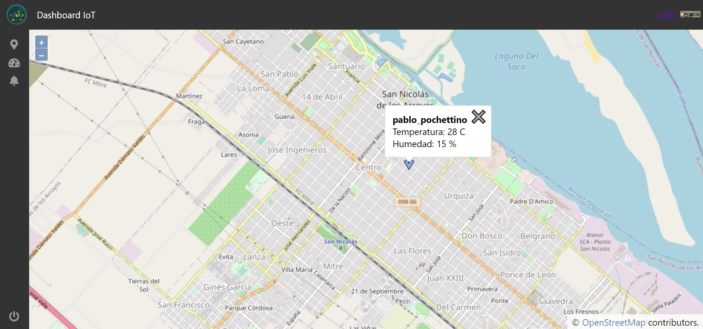
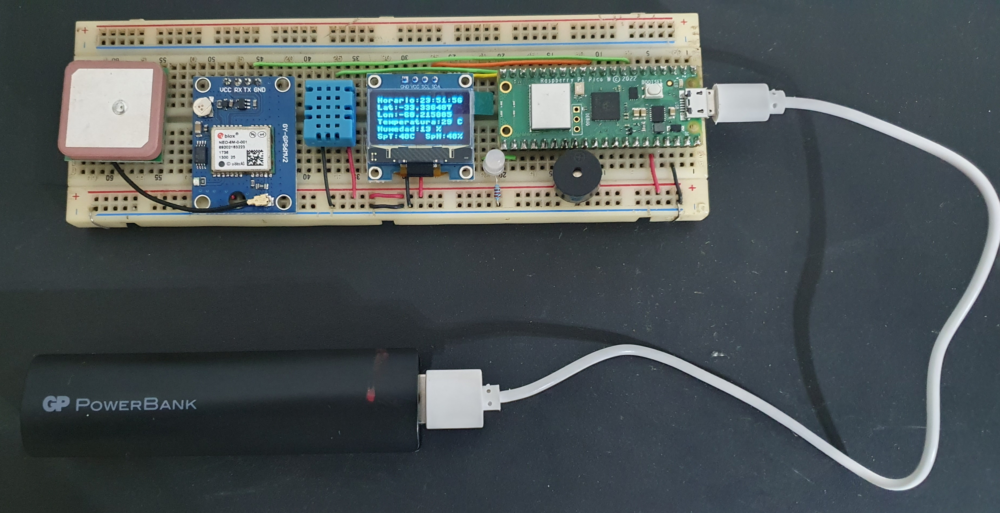
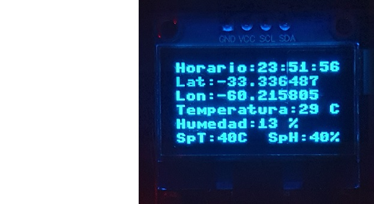
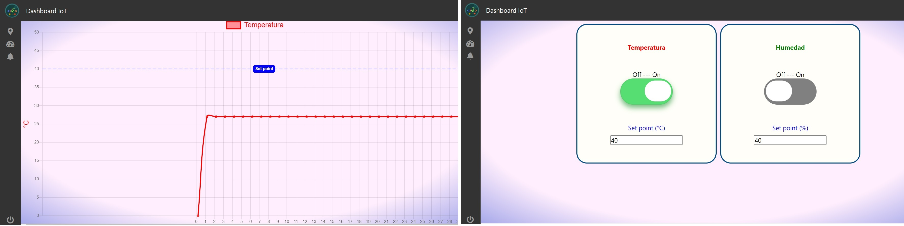

# Proyecto integrador:
Lenguaje: Python.\
Especialidad: IoT.

[)})](https://youtu.be/{[video_id](https://youtu.be/JQS-9QosLnw))})

  

# Sensor remoto IoT.

El proyecto consiste en la implementación de un dispositivo IoT capaz de monitorear y transmitir por wifi variables climáticas (temperatura y humedad) así como también la posición geográfica donde se encuentra el mismo, dispone a su vez de una salida de alarma (buzzer) que podrá ser accionada en caso de que alguna de las variables climáticas supere un determinado valor.

  

# Descripción del hardware:

- El dispositivo IoT está constituido por los siguientes elementos de hardware:
- Raspberry pi (Pico W) con Microcontrolador RP2040 Dual-Core ARM Cortex M0+ y Modulo WiFi (CYW43439) onboard.
- Modulo GPS (NEO 6M) con comunicación UART asincrónica.
- Sensor de temperatura y humedad (DHT11) con comunicación 1-wire.
- Pantalla OLED 128X64 (SSD1306) con comunicación I2C.
- Led rojo/verde y buzzer (actuadores) conectados a salidas digitales.

# Descripción del software:

La programación del dispositivo es realizada en Micropython sobre una raspberry pi picoW la cual ni bien es energizada corre la aplicación (main.py), donde, en primera instancia se definen y configuran los diferentes elementos de hardware (módulo wifi, gps, sensores, pantalla, etc.) y luego, una vez establecida la conexión con la red, se lanza el proceso principal(cliente mqtt) donde se realizan la publicación y suscripción de los diferentes tópicos, junto a un proceso secundario(measure_thread) que realiza la medición, gestión de las alarmas y displayado de las respectivas variables de campo.
- El código fuente es open source y puede descargarse desde:
https://github.com/PabloPoche/sensor_remoto_iot/tree/main/sensor_iot

# Broker mqtt remoto:

El dispositivo IoT trabaja en conjunto con la aplicación web inove_dashboard_iot, la que ha sido modificada para adaptarla a los requerimientos del dispositivo. Una vez lanzada la misma desde un browser puede accederse a las diferentes pantallas, donde, desde la solapa Ubicación puede visualizarse en un mapa donde se encuentra el dispositivo (icono azul) y al presionar con el mouse sobre el mismo puede visualizarse la temperatura y humedad medida en ese instante por el dispositivo.
Desde la solapa Sensores puede accederse al registro temporal de la temperatura y humedad, mientras que desde la solapa Alarmas es posible habilitar y setear los límites de accionamiento (set point) de las alarmas de temperatura y humedad. 
- Link app web: http://pablop.pythonanywhere.com/#
- El código fuente es open source y puede descargarse desde:
https://github.com/PabloPoche/sensor_remoto_iot/tree/main/dashboard_iot
- Link Docker: docker pull pablodk/dashboard_iot:latest
 

# Nota.
En este proyecto está orientado a integrar en una aplicación los conocimientos adquiridos durante el cursado de los 8 módulos de la especialidad Python IoT.

# Contacto.
Discord ID: PabloP#2073
